# Installation guide:  
1. composer install  
2. cp .env.example .env  
3. php artisan key:generate  
4. touch database/database.sqlite  
5. php artisan migrate  
6. npm install  
7. npm run dev  
8. herd link  
9. php artisan db:seed --class=DatabaseSeeder  
  
ConnectMe is a website to make friends to go for walks, hang out, game friends etc.  
  
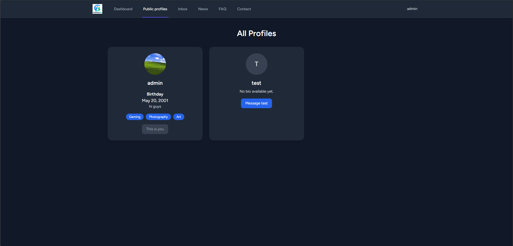
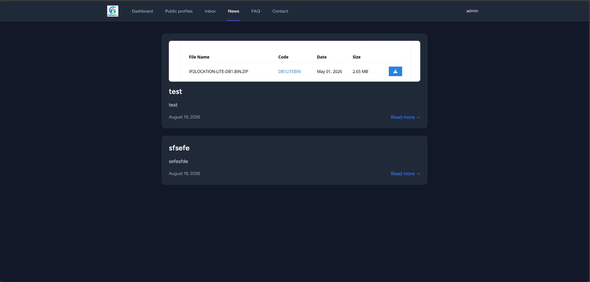
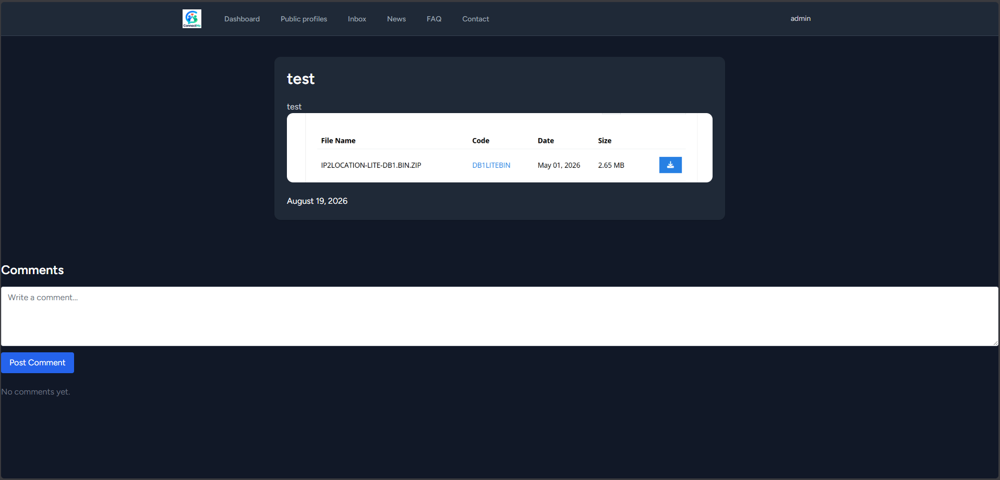
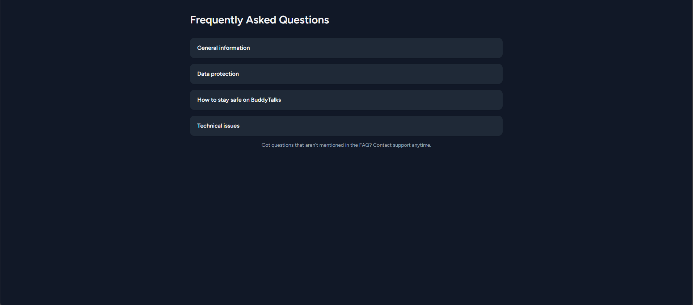
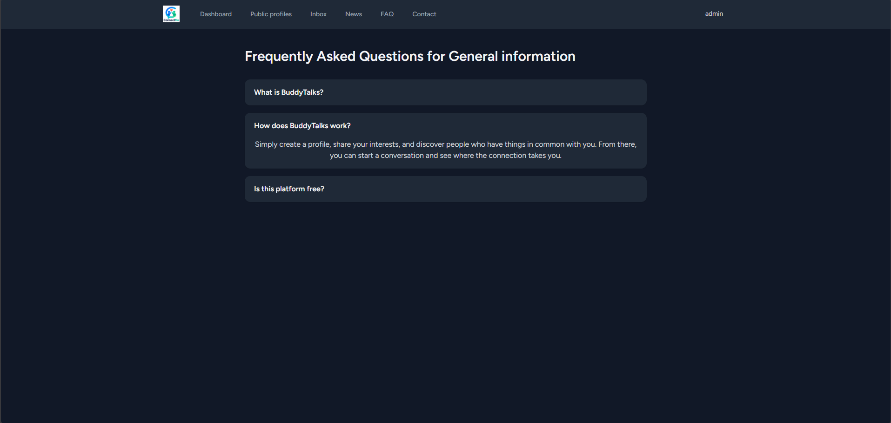
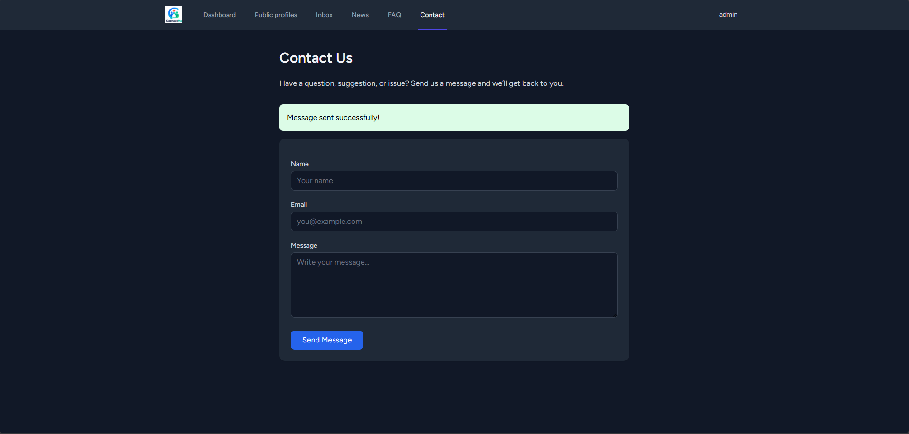
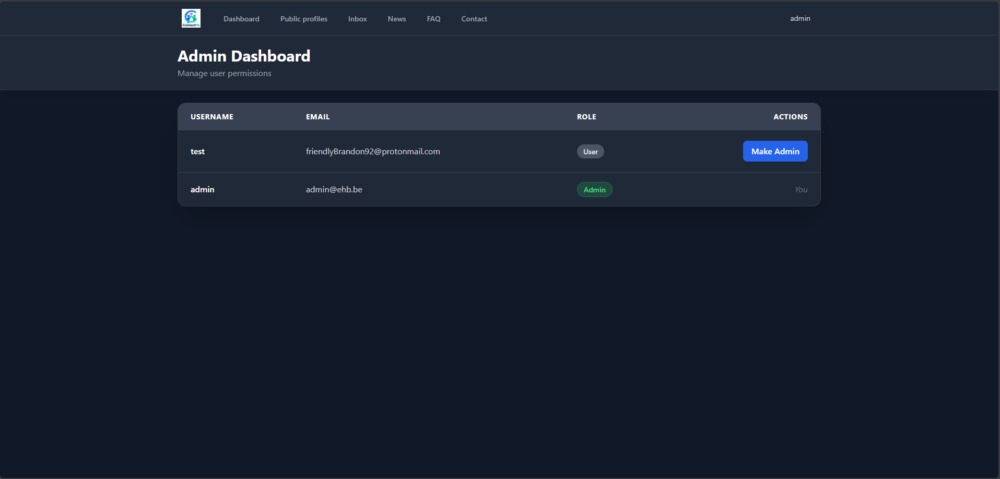 
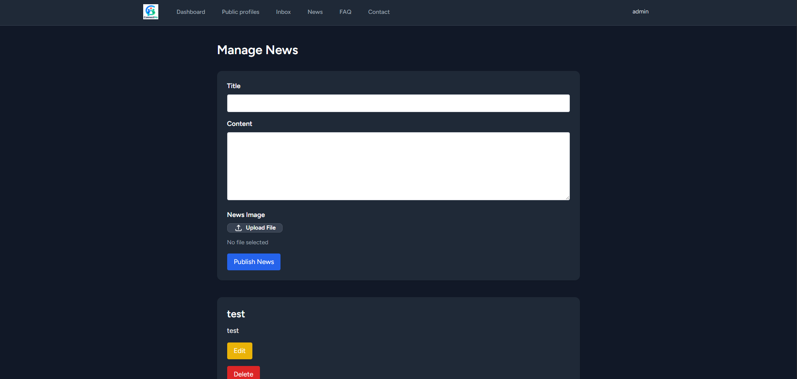
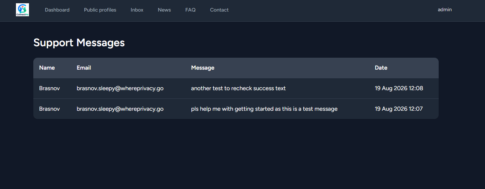
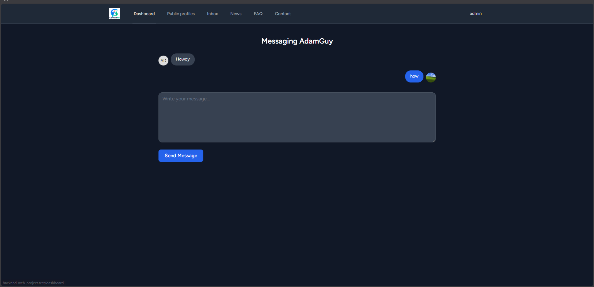
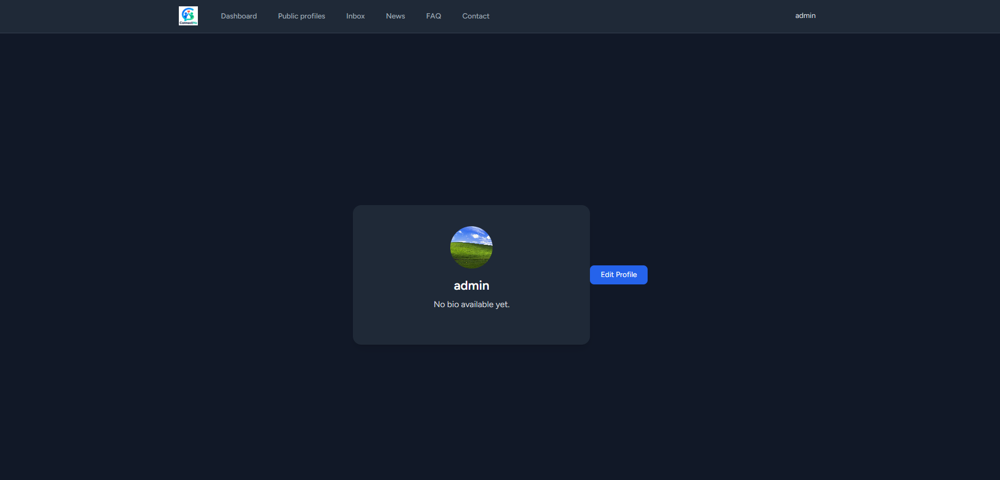
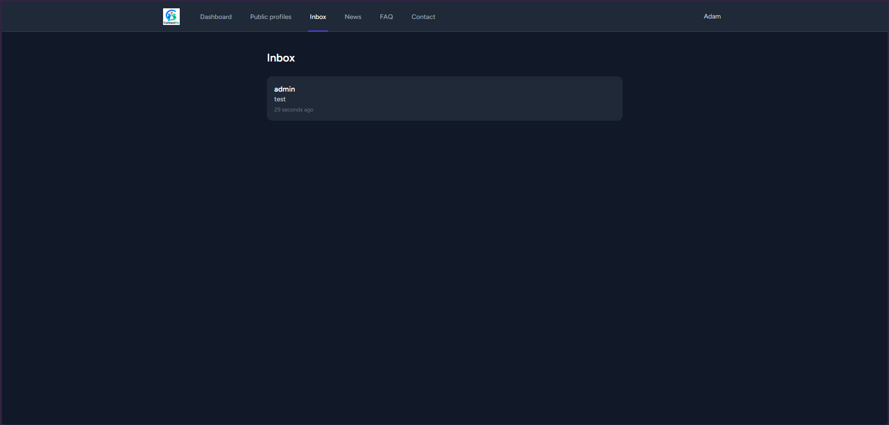
  
  
# Functionele vereisten:  
  
## -Login systeem (only resetting isn't functional):  
Bezoekers kunnen inloggen | resources\views\auth\login.blade.php  
Alle bezoekers kunnen een nieuwe account aanmaken | resources\views\auth\register.blade.php  
Een useraccount is of een gewone gebruiker, of een admin | database\migrations\0001_01_01_000000_create_users_table.php line 25  
Enkel admins kunnen andere gebruikers verheffen tot admin en deze rechten afnemen | app\Http\Controllers\AdminController.php line 18-32  
Enkel admins kunnen een nieuwe gebruiker manueel aanmaken (en deze al dan niet admin maken) | /  
  
## -Profielpagina:  
Elke gebruiker heeft zijn eigen publieke profielpagina die toegankelijk is voor iedereen, ook voor niet ingelogde gebruikers | resources\views\public-profiles\profiles-view.blade.php   
Een ingelogde gebruiker kan diens eigen data aanpassen | resources\views\profile\edit.blade.php  
Een profiel bevat minstens de volgende data (maar de velden zelf zijn optioneel):  
Username (dus de gebruiker kan zelf kiezen welke naam er op het profiel staat) | resources\views\profile\edit.blade.php line 55-66  
Verjaardag | resources\views\profile\edit.blade.php line 81-93  
Profielfoto (dat op de webserver zal bewaard worden) | resources\views\profile\edit.blade.php line 109-120  
Kleine "over mij" tekst | resources\views\profile\edit.blade.php line 96-106  
  
## -Laatste nieuwtjes:  
Admins kunnen nieuwe nieuwsitems toevoegen, wijzigen en verwijderen | resources\views\admin\news.blade.php  
Elke bezoeker kan een lijst van alle nieuwtjes en een detail per nieuwtje zien | resources\views\news\news.blade.php & resources\views\news\fullview.blade.php  
De nieuwsitems hebben minstens: app\Http\Controllers\NewsController.php | line 28-50  
Titel  
Afbeelding (opgeslagen op de server)  
Content  
Publicatiedatum  
  
## -FAQ pagina  
De FAQ-pagina bevat een lijst van vragen en antwoorden, gegroepeerd per categorie | resources\views\FAQ\FAQ.blade.php (no grouping or categories)  
Admins kunnen categorieën en vraag/antwoorden toevoegen, wijzigen en verwijderen | /  
Elke bezoeker kan de FAQ zien | resources\views\FAQ\FAQ.blade.php & routes\web.php line 71-74  
  
## -Contact pagina  
Elke bezoeker kan een contactformulier invullen | resources\views\contact.blade.php  
Bij het versturen van dit contactformulier krijgt de admin een email met de inhoud van het formulier | /  
  
------------------------------------------------------------------------------------------------------------------------------------------------------------
  
# Technische vereisten  
## -Views  
Gebruik minstens twee layouts | resources\views\layouts  
Gebruik een component waar logisch | resources\views\public-profiles\profiles-view.blade.php line 1  
Gebruik de technieken die aan bod gekomen zijn in de cursus en de oefeningen  
Control structures  
XSS protection | resources\views\admin\news.blade.php line 67  
CSRF protection | resources\views\admin\edit-news.blade.php line 24  
Client-side validation  
## -Routes  
Alle routes gebruiken controller methods | routes\web.php  
Alle routes gebruiken de nodige middleware | routes\web.php  
Indien mogelijk: groepeer je routes | routes\web.php  
## -Controller  
Gebruik controllers om je logica op te splitsen | app\Http\Controllers  
Denk terug aan resource controllers voor CRUD operaties | routes\web.php line 69-73  
## -Models | app\Models  
Gebruik Eloquent models per entiteit | app\Models\CommentsOnNews.php line 7  
Les de nodige relaties  
Minstens één one-to-many | app\Http\Controllers\NewsController.php line 51-56  
Optioneel een many-to-many  
