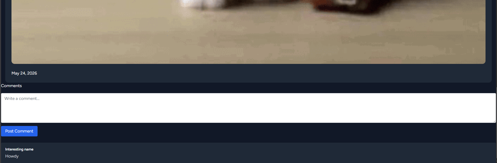
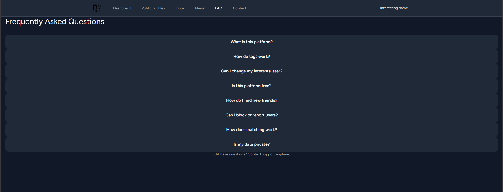
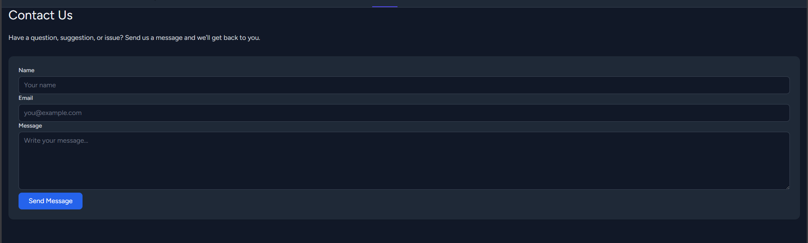
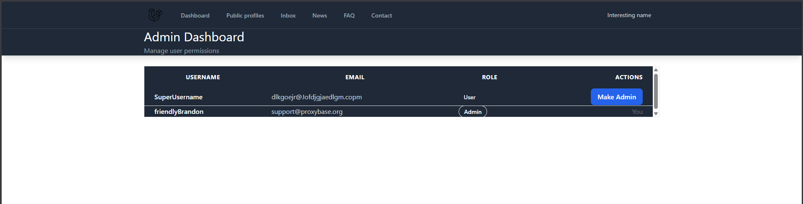
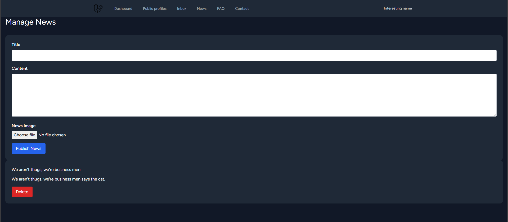
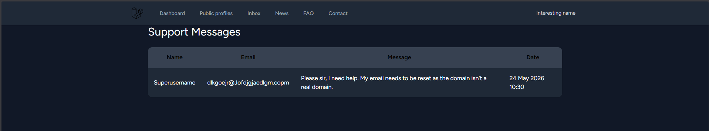
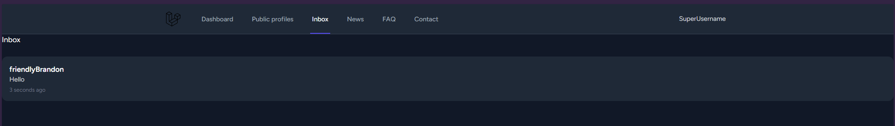
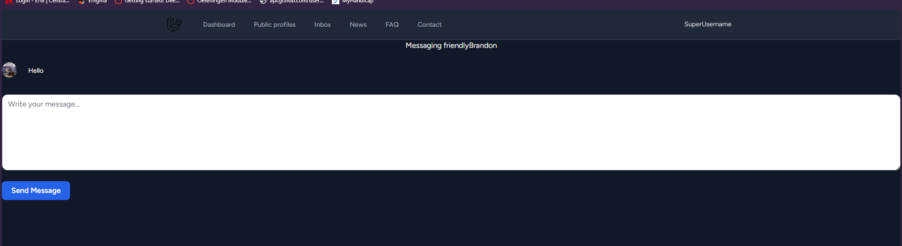
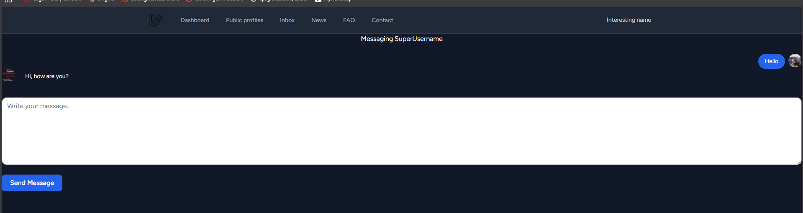

Installation guide:
1. composer install
2. cp .env.example .env
3. php artisan key:generate
4. touch database/database.sqlite
5. php artisan migrate
6. npm install
7. npm run dev
8. herd link
9. php artisan db:seed --class=DatabaseSeeder

ConnectMe is a website to make friends to go for walks, hang out, game friends etc.

